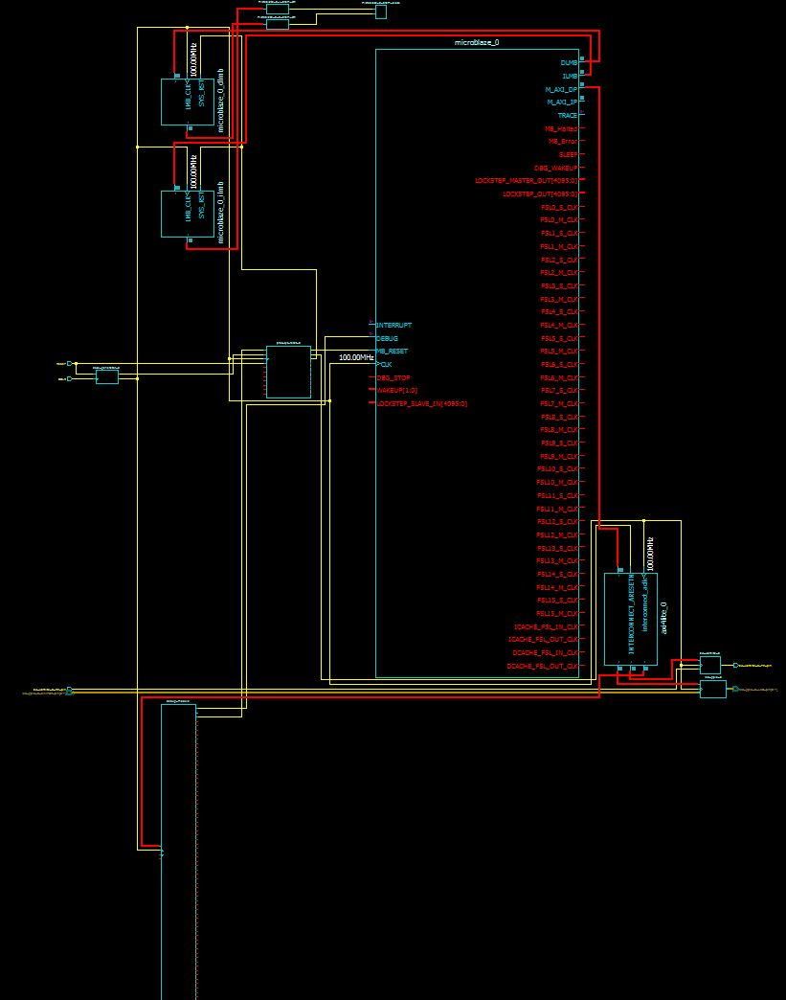

Lab_4b_microblaze
=================

objective
---
For Lab 4B, we were required to complete all the functionality of lab 4A utilizing microblaze instead of picoblaze. 

Discussion and troubleshooting
---

My design looks like this:


The big difference between lab 4B and lab 4A was utilizing microblaze and all the tools that go along with that. 4A was a lot of coding. We were still writing VHDL code directly and were imorting the picoblaze design. because picoblaze is only an 8 bit system, we did not have the ablility to utilize a HLL like C. We were required to use ASM as our programing language. Upon switching to microblaze, the problem should have become a lot easier. The tools developed all the code with the exception of the C program. Unfortunately, in order to get our parts to work, we had to make a few changes to the code that the tools created. The largest change that took the longest to figure out was in our user logic code. we had to add the following code to our design. 

```vhdl
  --USER logic implementation added here
	LED <= slv_reg0(7 downto 0);
```
unfortunately, the tutorial had us add:

```vhdl
  --USER logic implementation added here
	LED <= slv_reg0(31 downto 24);
```

For the life of me, I could not figure out that I needed to change which signals on the slv_reg0 bus to read from. It was not until C2C Nikolas Taormina told me about the fix that I was able to get my project to work. 

The other code we had to add to our user logic was:

```vhdl
  -- implement slave model software accessible register(s) read mux
  SLAVE_REG_READ_PROC : process( slv_reg_read_sel, slv_reg0, slv_reg1, slv_reg2, slv_reg3, slv_reg4, slv_reg5, slv_reg6, slv_reg7 ) is
  begin

    case slv_reg_read_sel is
       when "10000000" => slv_ip2bus_data <= slv_reg0(C_SLV_DWIDTH-1 downto 0);
      when "01000000" => slv_ip2bus_data <= "000000000000000000000000" & SWITCH;
      when "00100000" => slv_ip2bus_data <= slv_reg2(C_SLV_DWIDTH-1 downto 0);
      when "00010000" => slv_ip2bus_data <= slv_reg3(C_SLV_DWIDTH-1 downto 0);
      when "00001000" => slv_ip2bus_data <= slv_reg4(C_SLV_DWIDTH-1 downto 0);
      when "00000100" => slv_ip2bus_data <= slv_reg5(C_SLV_DWIDTH-1 downto 0);
      when "00000010" => slv_ip2bus_data <= slv_reg6(C_SLV_DWIDTH-1 downto 0);
      when "00000001" => slv_ip2bus_data <= slv_reg7(C_SLV_DWIDTH-1 downto 0);
      when others => slv_ip2bus_data <= (others => '0');
    end case;

  end process SLAVE_REG_READ_PROC;
```

This allowed us to access the switches. In our C code, to read from the switches, we had to add the code:
```C
unsigned char switchPosition = Xil_In8(0x83000004);
```

The 4 at the end of the string was another stumper as well. Once again C2C Nikolas Taormina told me about that. I still have no idea why it needs to be 4.

The other major issue I had with this lab was getting xilinx to work. I was running 14.1 previously which would not work for microblaze. Getting the new software installed took quite a while. After I got it installed, I spent two days trying to get my license to work. I received one from xilinx and my program would not recognize it. Only after I started to use the DFEC license server did my program start to work. The moment it started to work, 10th comm changed the IP addresses for everyone and the license server was unreachable. This caused my program to crash once again. 

Conclusion
---

After everything was said and done, the lab was rather simple. The hardest part was finding the quarks in the programming. The lines of code that needed to be added to the user logic was unintuitive. Also, it would have been nice to have working software from the get go. I added around 10 hours to my project time simply because I was debugging issues that had to deal with my software. 
